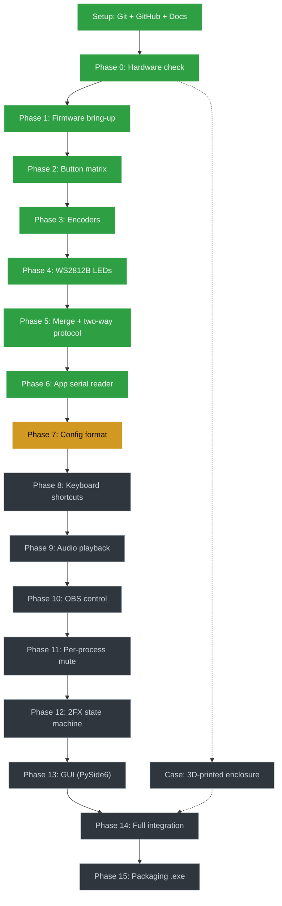

# Stream Deck Macro

DIY macro deck (Elgato Stream Deck style), built around an Arduino Pro Micro
(ATmega32U4): 4x4 button matrix with a secondary layer (2FX), 3 rotary
encoders for audio control, and individually addressable WS2812B LEDs per
key.

A companion Python app (PySide6) receives firmware events over serial and
executes the configured actions: keyboard shortcuts, OBS scene control, sound
playback, and real per-app mute.

## Status

Planning / study phase. Hardware architecture and protocol are already
defined; implementation hasn't started yet.

## Roadmap

Full checklist with descriptions: [ROADMAP.md](ROADMAP.md)

## Learning project

This repository is also a learning exercise in Git, GitHub, and Python.
