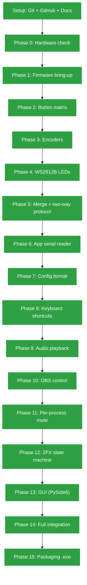

# Stream Deck Macro

DIY macro deck (Elgato Stream Deck style), built around an Arduino Pro Micro
(ATmega32U4): 4x4 button matrix with a secondary layer (2FX), 3 rotary
encoders for audio control, and individually addressable WS2812B LEDs per
key.

A companion Python app (PySide6) receives firmware events over serial and
executes the configured actions: keyboard shortcuts, OBS scene control, sound
playback, and real per-app mute.

## Status

Working and packaged. The firmware (matrix, encoder, LEDs, identity
handshake) is verified on hardware, and the companion app ships as a
Windows installer with a user manual in English and Portuguese
([EN](docs/MANUAL.md) · [PT](docs/MANUAL_PT.md)).

## 3D-printed enclosure

The case is **not distributed in this repository**. It is published and
sold separately on 3D model marketplaces — the STL and SCAD sources are a
standalone product, not part of this source tree. A link will be added here
once it is live.

This repository covers the electronics, firmware, companion app and
documentation.

## Roadmap

```mermaid
flowchart TD
    S["Setup: Git + GitHub + Docs"]:::done --> P0["Phase 0: Hardware check"]:::done
    P0 --> P1["Phase 1: Firmware bring-up"]:::done
    P1 --> P2["Phase 2: Button matrix"]:::done
    P2 --> P3["Phase 3: Encoders"]:::done
    P3 --> P4["Phase 4: WS2812B LEDs"]:::done
    P4 --> P5["Phase 5: Merge + two-way protocol"]:::done
    P5 --> P6["Phase 6: App serial reader"]:::done
    P6 --> P7["Phase 7: Config format"]:::done
    P7 --> P8["Phase 8: Keyboard shortcuts"]:::done
    P8 --> P9["Phase 9: Audio playback"]:::done
    P9 --> P10["Phase 10: OBS control"]:::done
    P10 --> P11["Phase 11: Per-process mute"]:::done
    P11 --> P12["Phase 12: 2FX state machine"]:::done
    P12 --> P13["Phase 13: GUI (PySide6)"]:::done
    P13 --> P14["Phase 14: Full integration"]:::done
    P14 --> P15["Phase 15: Packaging .exe"]:::done

    classDef done fill:#2ea043,stroke:#2ea043,color:#fff
```

Full checklist with descriptions: [ROADMAP.md](ROADMAP.md)

## Learning project

This repository is also a learning exercise in Git, GitHub, and Python.
