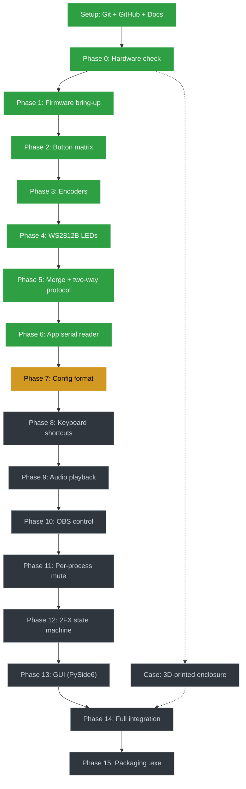

# Roadmap

Each phase is a prerequisite for the next one, unless marked as a parallel
track. Status is updated manually as the project progresses.

🟢 done · 🟡 current · ⬛ not started

## Checklist

- [x] Setup — Git, GitHub repo, README, LICENSE, .gitignore, CLAUDE.md
- [x] Phase 0 — Hardware check (confirmed: Pro Micro 5V / 16MHz variant, no level shifter needed)
- [x] Phase 1 — Firmware bring-up (toolchain, blink, serial hello world)
- [x] Phase 2 — Firmware: button matrix scanning (all 16 positions confirmed)
- [x] Phase 3 — Firmware: rotary encoders (CW/CCW/PUSH logic verified on 1 of 3 encoders; other 2 are only repeats of the same wiring, to be confirmed when in hand)
- [x] Phase 4 — Firmware: WS2812B LEDs (chaining + color order confirmed on 9 spare bare LEDs; original 100+ LED reel is faulty, unresolved — see CLAUDE.md)
- [x] Phase 5 — Firmware: merge (matrix + encoder + LEDs, one sketch) done; **two-way protocol (PC→firmware LED commands) deliberately deferred** — revisit before Phase 14
- [x] Phase 6 — App: serial reader (pyserial), confirmed reading BTN/ENC events live
- [ ] Phase 7 — App: config file format (button → action mapping) **← current**
- [ ] Phase 8 — App: keyboard shortcut execution
- [ ] Phase 9 — App: audio playback
- [ ] Phase 10 — App: OBS control (obsws-python)
- [ ] Phase 11 — App: real per-process mute (pycaw)
- [ ] Phase 12 — App: 2FX layer state machine
- [ ] Phase 13 — App: GUI (PySide6)
- [ ] Phase 14 — Full integration (firmware + app, real hardware)
- [ ] Phase 15 — Packaging (PyInstaller .exe)
- [ ] Case — 3D-printed enclosure (parallel track, not blocking)
