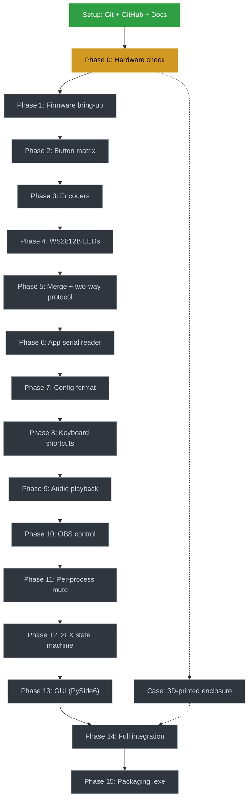

# Roadmap

Each phase is a prerequisite for the next one, unless marked as a parallel
track. Status is updated manually as the project progresses.

🟢 done · 🟡 current · ⬛ not started

## Checklist

- [x] Setup — Git, GitHub repo, README, LICENSE, .gitignore, CLAUDE.md
- [ ] Phase 0 — Hardware check (confirm Pro Micro voltage variant) **← current**
- [ ] Phase 1 — Firmware bring-up (toolchain, blink, serial hello world)
- [ ] Phase 2 — Firmware: button matrix scanning
- [ ] Phase 3 — Firmware: rotary encoders
- [ ] Phase 4 — Firmware: WS2812B LEDs
- [ ] Phase 5 — Firmware: merge + two-way serial protocol
- [ ] Phase 6 — App: serial reader (pyserial)
- [ ] Phase 7 — App: config file format (button → action mapping)
- [ ] Phase 8 — App: keyboard shortcut execution
- [ ] Phase 9 — App: audio playback
- [ ] Phase 10 — App: OBS control (obsws-python)
- [ ] Phase 11 — App: real per-process mute (pycaw)
- [ ] Phase 12 — App: 2FX layer state machine
- [ ] Phase 13 — App: GUI (PySide6)
- [ ] Phase 14 — Full integration (firmware + app, real hardware)
- [ ] Phase 15 — Packaging (PyInstaller .exe)
- [ ] Case — 3D-printed enclosure (parallel track, not blocking)
