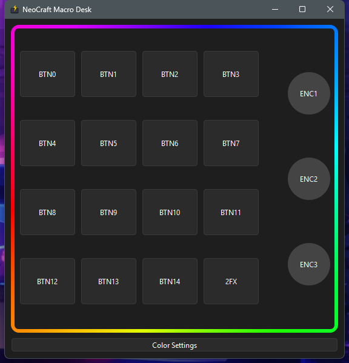
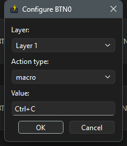
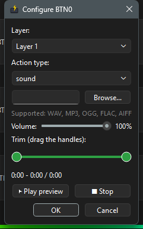
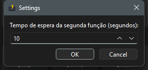
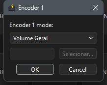
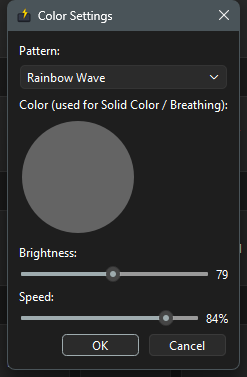
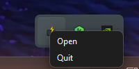

# NeoCraft Macro Desk — User Manual

A custom macro pad: a 4×4 button grid plus 3 rotary encoders, paired with a
Windows desktop app that decides what each button and encoder does.

---

## Part 1 — What it does

### The hardware
- **16 buttons** arranged in a 4×4 grid. 15 of them (`BTN0`–`BTN14`) run
  actions you assign. The 16th, **`2FX`**, is not an action button — it's a
  layer switch (see below).
- **3 rotary encoders** (`ENC1`–`ENC3`). Turning one adjusts a volume; clicking
  it in mutes/unmutes. *Currently only ENC1 is wired up in the firmware —
  ENC2 and ENC3 are physically present but not active yet.*
- **Addressable LEDs**, one per key, showing an animated color pattern while
  everything's connected, or **solid red** if the app isn't running/connected
  — a built-in reminder to start the app.

### The app
A small program that lives in your system tray. It talks to the pad over
USB and lets you assign an action to every button, and a volume target to
every encoder. Each button can do one of these:

| Action type | What it does |
|---|---|
| **Keyboard** | Sends a key combo (e.g. `ctrl+c`) to whatever app is focused |
| **Macro** | Same as Keyboard, but you record the combo by pressing it live instead of typing it |
| **OBS Scene** | Switches OBS Studio to a specific scene (requires OBS running with its WebSocket server on) |
| **Sound** | Plays an audio file (WAV, MP3, OGG, FLAC, AIFF) — with volume and trim controls |
| **Empty** | Does nothing (the button's default state) |

Each encoder can control either your **system's overall volume**, or the
volume of **one specific application** (even multi-window apps like a
browser) — your choice, set per encoder.

### The "2FX" second layer
Every button can hold **two different actions** — a normal one (Layer 1) and
a second one (Layer 2) that only fires when you deliberately arm it:

1. Tap **`2FX`** — the border flashes red, Layer 2 is now armed.
2. Tap any other button — it runs *that button's Layer 2 action*, then the
   pad automatically drops back to Layer 1.
3. If you don't press anything, Layer 2 auto-cancels after a timeout
   (10 seconds by default, adjustable up to 60s).
4. Tapping **`2FX`** again while armed cancels it manually, with no action
   run.

This is how one 16-key pad gives you effectively 30 assignable actions.

### Background operation
Closing the app window (the **X** button) doesn't quit it — it minimizes to
the system tray and keeps running, so your button/encoder mappings stay
active. Use the tray icon's **Quit** option to fully exit.

### Language
The app is available in **English** and **Português**, switchable at any
time from Settings (see [Changing the app language](#changing-the-app-language)).
Defaults to Português. *Note: the screenshots in this manual were captured
before this feature existed, so a few labels shown (dialog titles, button
text) are in whichever language they defaulted to at the time — the dialog
layout and flow are identical, only the wording changes per language now.*

---

## Part 2 — Installation

1. Download `NeoCraft-Macro-Desk-Setup.exe`.
2. Double-click it. **No administrator prompt will appear** — this installs
   just for your Windows account, not system-wide.
3. Optionally check **"Create a desktop shortcut"** in the wizard.
4. Click through to finish. The installer creates a Start Menu entry
   (**NeoCraft Macro Desk**) and an uninstaller.
5. Plug in the macro pad via USB.
6. Launch the app (Start Menu, or the desktop shortcut if you created one).

The app connects automatically — no setup dialog, no drivers to install
separately (Windows' built-in USB-serial driver handles the Pro Micro).

**If the LEDs stay solid red after launching the app:** the app looks for
the pad specifically on **COM5**. If your pad enumerates on a different COM
port (check Windows Device Manager → Ports (COM & LPT)), it won't connect
automatically — this is a known current limitation, not a sign anything is
broken.

**To uninstall:** Start Menu → NeoCraft Macro Desk → "Uninstall NeoCraft
Macro Desk," or Windows Settings → Apps. Your saved button/encoder
configuration is kept (in case you reinstall later) — see
[Where your settings are saved](#where-your-settings-are-saved) if you want
to remove it manually too.

---

## Part 3 — How to use each function

### The main window



*Note: this screenshot predates a small layout change — the single bottom
button is now three side by side: **Color Settings**, **Settings**, and
**Help** (see below).*

A 4×4 grid of buttons plus the 3 encoders on the right. The animated border
shows the pad's current LED pattern live. Click **any button** to configure
it. Below the grid, three buttons:
- **Color Settings** — change the LED pattern (see
  [Changing the LED pattern](#changing-the-led-pattern)).
- **Settings** — 2FX timeout and app language (see
  [Changing the app language](#changing-the-app-language)).
- **Help** — app version and links to this manual and the GitHub repo (see
  [Help](#help)).

### Assigning a keyboard shortcut or macro to a button

1. Click the button you want to configure (e.g. `BTN0`).
2. Choose the **Layer** (Layer 1 = normal, Layer 2 (2FX) = second function).
3. Set **Action type** to **Keyboard** or **Macro**.
   - **Keyboard**: type the combo directly, e.g. `ctrl+c`.
   - **Macro**: click into the field and press the actual key combo on your
     keyboard — it's captured live.
4. Click **OK** to save.



### Assigning a sound to a button

1. Click the button, set **Action type** to **Sound**.
2. Click **Browse...** and pick an audio file (WAV, MP3, OGG, FLAC, or AIFF).
3. Adjust **Volume** with the slider (0–100%).
4. Drag the two handles under **Trim** to play only part of the clip — the
   label below shows the selected start/end time and the clip's total
   length.
5. Use **▶ Play preview** / **■ Stop** to check it sounds right before
   saving.
6. Click **OK**.



### Assigning an OBS scene switch

1. Click the button, set **Action type** to **OBS Scene**.
2. Type the exact scene name as it appears in OBS.
3. Click **OK**.

This requires OBS Studio running with its WebSocket server enabled
(OBS 28+ has this built in — Tools → WebSocket Server Settings).

### Clearing a button

Set its **Action type** to **Empty** and click **OK**.

### Using the 2FX second layer

Tap the **`2FX`** key on the pad (bottom-right of the grid). The app border
flashes red while armed. The next button you press runs its **Layer 2**
action instead of Layer 1, then the pad returns to normal automatically. Tap
`2FX` again before pressing anything else to cancel without running an
action.

To change how long Layer 2 stays armed before auto-canceling, click the
**Settings** button below the grid:



### Changing the app language

Open the same **Settings** dialog and use the **Language** / **Idioma**
dropdown at the bottom — pick **English** or **Português** and click **OK**.
The change applies immediately: any dialog you open next (button config,
encoder config, color settings) shows the new language right away, no
restart needed. The **Color Settings**/**Settings**/**Help** buttons and the
tray menu's Open/Quit labels update immediately too.

### Help

Click the **Help** button below the grid for the app's version number and
two links — one to this manual on GitHub, one to the project's GitHub repo.
Both open in your default browser.

### Configuring an encoder

1. Click an encoder (`ENC1`, `ENC2`, or `ENC3`) in the app window.
2. Choose the mode:
   - **System Volume** (**Volume Geral** in Português) — controls your
     system's overall Windows volume.
   - **Application** (**Aplicativo**) — controls one specific application's
     volume independently (click **Select...** and pick its `.exe`). This
     works correctly even for apps that run as many processes at once,
     like Chromium-based browsers.
3. Click **OK**.



Once configured: **turn** the encoder to adjust volume up/down, **click** it
(push down) to mute/unmute.

### Changing the LED pattern

Click **Color Settings** at the bottom of the main window.



- **Pattern**: Solid Color, Breathing, Rainbow Wave, or Color Cycle.
- **Color**: pick a color on the wheel — only used by Solid Color and
  Breathing (grayed out otherwise, since Rainbow Wave and Color Cycle
  generate their own colors).
- **Brightness** / **Speed**: sliders, applied immediately and saved with
  the rest of your settings.

### The system tray icon



Right-click (or on some systems, left-click) the tray icon for:
- **Open** — bring the main window back.
- **Quit** — fully close the app (button/encoder mappings stop working
  until you reopen it, and the pad's LEDs go solid red).

### Where your settings are saved

Your button mappings, encoder targets, and color settings are stored in:

```
%APPDATA%\NeoCraft Macro Desk\config.json
```

This file persists across app updates and reinstalls. Deleting it resets
everything to defaults the next time the app starts.
